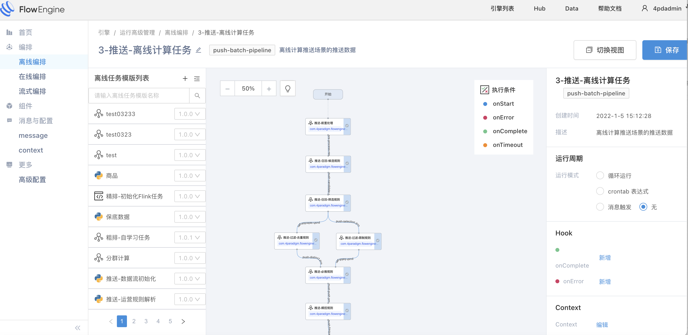
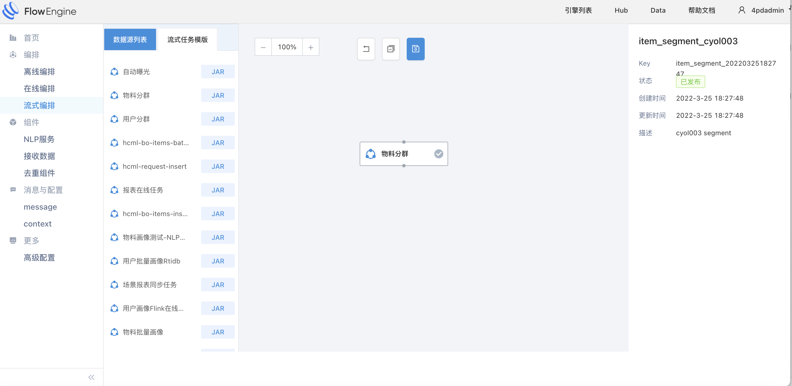
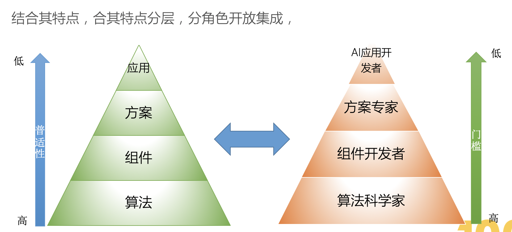

## 1.6.2 FlowEngine 设计初衷

### 如何提升AI/策略类项目或产品的开发的和落地效率？
* 技术及业务流程变化快，如何才能更快响应变化，又不让项目腐化难以维护？
* 如何低门槛的编排和集成复杂多样的底层组件和上层业务流程?
* 如何应对不同行业，不同体量，不同业务对AI落地的个性化诉求?
* 如何能够沉淀，复用和迁移的解决方案，能够一次构建，各处使用？
* 如何能够在统一的AI或策略类应用领域概念基础上，低门槛，正确的开发产品或项目？

## FlowEngine 定位

Flowengine 是一个基于范式“学习圈”方法论的，声明式，低代码，组件化的应用编排框架，集在线，离线，流式三大编排为一体，助力正确，高效的落地AI场景。


* **离线编排**
  去中心弹性扩展，支持常见的离线数据任务计算，调度监控等需求

* **在线编排**
  支持灵活定义弹性的在线业务请求流程，低延迟，框架overhead忽略不计

* **流式编排**
  可根据业务低成本，快速搭建流式数据处理管道（可由多个flink任务构成），满足多变的流式数据处理需要


#### FlowEngine 核心能力：

* 简单一致的声明式API/SDK/GUI/CLI
* 业务流，数据流编排（离线编排，在线编排，流式编排）（低门槛，低代码）
* 架构开放的基础上，内置Runtime支撑80%以上场景 （开放性，组件化）
* 应用方案沉淀，迁移，一键重建（以 asol 为核心）

## 我们的设计理念

当下，AI/策略类应用通常面对业务流和数据流复杂多变，各种中间件集成困难的痛点，随着场景的不断增多，开发和维护都将变成灾难。 flowengine便是切入到这一领域问题，它将过去的胶水拼凑及无序堆叠的业务逻辑和组件服务，变得体系化，简单可编排，从而有效提升开发效率，过去几个团队共同维护的系统，通过它一两个人便能开发管理。
AI技术及产业落地是当下学术界和工业界炙手可热的领域，源源不断的新技术和工具在不断更新迭代。 在拥抱开源文化的不断盛行的背景下，如何能够在自研和开源寻找平衡，是每一个技术框架和工具想要保持长青需要考虑的问题。
 ### <b>FlowEngine是怎么考虑的？</b>
首先，基于它编排和集成连接的定位，专注中间层业务流数据流编排，方案/能力沉淀迁移构建，这使得它天然开放，开源的组件和技术可以开放的集成进来，可以不断从开源环境下吸取养分使得它更强，另一方面，对它的使用者提供一个稳定的，一致的接入层，用户只需要学习一次便能够通过它灵活应对多变的复杂的业务环境，
然后，共享生态，自我成长也是保证它长青的关键，我们面向不同的角色提供不同的参与方式，并使得他们能够在统一的体系下协作，在用户自身也获得了便利的同时，在框架本身能力也获得了丰富和强化。


## 如何生成 PDF

``` bash
docker pull avastmick/ebook-builder
docker run -it -v ~/elf-automl-desktop/src/docs:/ebook-docs avastmick/ebook-builder bash
cd ebook-docs
gitbook pdf .
```
