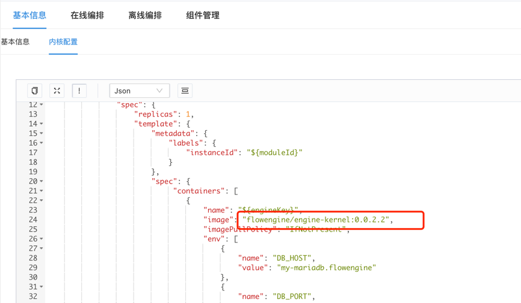

# 07-如何自定义enginekernel镜像？

enginekernel为了避免镜像过大，因此不必要的程序包和依赖并未默认安装，但我们在实际的使用过程中，以下情况可能需要定制内核镜像。

* 安装或者升级未预制软件
* 安装或者升级python lib包
* 内置文件或者数据

## 解决方案：

### 1.制作镜像

在自定义自己镜像前，先了解一下默认的dockerfile

```
FROM flowengine/base-java8-python3-with-cppdep:0.0.1

ADD ./Shanghai /opt/work/config/
ENV LANG C.UTF-8

RUN mkdir -p /opt/work/bin && mkdir -p /opt/work/config \
&& mkdir -p /opt/work/lib \
&& mkdir -p /opt/work/script \
&& mkdir -p /opt/work/portal/dist \
&& mkdir -p /opt/work/solution \
&& mkdir -p /opt/work/tmp/asol/

RUN pip3 install  --upgrade  -i http://mirrors.aliyun.com/pypi/simple/ --trusted-host mirrors.aliyun.com  --user \
    simplejson==3.17.6  \
    jieba==0.39  \
    smart-open==1.8.3  \
    annoy==1.16.3
RUN pip3 install  --upgrade  -i http://mirrors.aliyun.com/pypi/simple/ --trusted-host mirrors.aliyun.com  --user \
    pyhdfs==0.3.1 \
    pymysql==1.0.2 \
    PyYAML==5.1.1
RUN pip3 install  --upgrade  -i http://mirrors.aliyun.com/pypi/simple/ --trusted-host mirrors.aliyun.com  --user \
    requests==2.19.1 \
    pysftp==0.2.9 \
    psutil==5.6.7

COPY ./solution /opt/work/solution/
COPY ./bin/* /opt/work/bin/
COPY ./target/engine-kernel-0.0.2.jar /opt/work/engine-kernel.jar
COPY ./target/dependency/* /opt/work/lib/
COPY ./config/* /opt/work/config/
ADD ./dist.tar.gz /opt/work/portal/
COPY ./script/ /opt/work/script/
WORKDIR /opt/work

EXPOSE 8080

ENTRYPOINT ["/opt/work/bin/start.sh"]
```

其他base镜像参考
https://github.com/flow-engine/fl-commons/tree/master/base-images

#### 1）简单增加

> 内核镜像默认是基于alpine制作，因此安装软件方式参考alpine写法。

只需要继承现有enginekernel镜像，添加自定义的内容即可，如下，即在0.0.2.1版本上安装numpy包的案例。

1) 新建Dockerfile文件

```
FROM flowengine/engine-kernel:0.0.2.1
RUN apk --no-cache add --virtual .builddeps gcc gfortran musl-dev lapack libstdc++ g++ gcc lapack-dev libffi-dev libc-dev libc6-compat
RUN pip3 install --upgrade  -i http://mirrors.aliyun.com/pypi/simple/ --trusted-host mirrors.aliyun.com  --user \
    numpy==1.21.6
```

2) docker build -t engine-kernel:0.0.2.1-custom .
   执行结果如下：

```
[root@meteor0-2 tmp]# docker build -f ./Dockerfile  -t engine-kernel:0.0.2.1-custom .
Sending build context to Docker daemon  4.608kB
Step 1/4 : from flowengine/engine-kernel:0.0.2.1
 ---> ad0a80c07847
Step 2/4 : RUN apk --no-cache add --virtual .builddeps gcc gfortran musl-dev lapack libstdc++ g++ gcc lapack-dev libffi-dev libc-dev libc6-compat
 ---> Using cache
 ---> 487721160fba
Step 3/4 : RUN pip3 install --upgrade  -i http://mirrors.aliyun.com/pypi/simple/ --trusted-host mirrors.aliyun.com  --user     numpy==1.21.6
 ---> Using cache
 ---> 343145be675c
Step 4/4 : WORKDIR /app
 ---> Using cache
 ---> e7458033d9a3
Successfully built e7458033d9a3
Successfully tagged engine-kernel:0.0.2.1-custom
```

#### 2）base镜像无法满足需要，需要完全定制

可基于基础镜像，将默认镜像中enginekernel中的 /opt/work 及Shanghai复制出来，放置在新的待打包镜像目录中。
基础镜像必须支持jdk 1.8 和python 3.7+

参考默认镜像写法，修改如下：

```
# 自定义或者官方其他base镜像
FROM otherbaseimage:0.0.1
ADD ./Shanghai /opt/work/config/
ENV LANG C.UTF-8

RUN mkdir -p /opt/work/bin && mkdir -p /opt/work/config \
&& mkdir -p /opt/work/lib \
&& mkdir -p /opt/work/script \
&& mkdir -p /opt/work/portal/dist \
&& mkdir -p /opt/work/solution \
&& mkdir -p /opt/work/tmp/asol/


COPY ./solution /opt/work/solution/
COPY ./bin/* /opt/work/bin/
COPY ./engine-kernel.jar /opt/work/engine-kernel.jar
COPY ./lib/* /opt/work/lib/
COPY ./config/* /opt/work/config/
ADD ./portal/* /opt/work/portal/
COPY ./script/ /opt/work/script/
WORKDIR /opt/work

EXPOSE 8080

ENTRYPOINT ["/opt/work/bin/start.sh"]
```

至此即可生成自定义镜像。

### 2.应用部署

1. 仅在当前引擎生效,修改当前内核配置即可。
   {:width="50%" }
2. 方案级生效，可在方案中修改内核镜像配置即可，根据该方案创建的引擎将使用新镜像运行，老引擎不影响。
   {:width="50%" }
