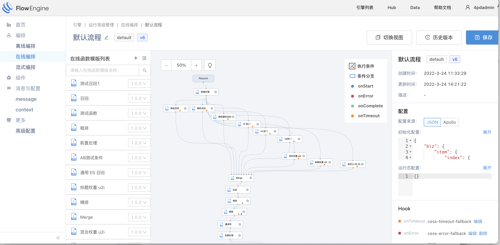

## FlowEngine 定位

对于一个数据驱动型应用，一般需要多个子系统或者中间件来支持离线批量任务处理，近线流式任务处理，和在线实时请求，在现有架构中，三者割裂，支撑工具各有不同，服务运维和上层编程接口及操作方式各不相同，导致协同工作，运营维护，整体优化变得很困难，技术团队不得不花费大量人力和机器成本来维持系统运转，另一方面，数据驱动型系统一个重要特点就是数据和策略频繁变化，缺少灵活的策略编排能力及策略方案版本管理，分享，重建能力，导致应用开发，测试，部署都十分困难。

**FloweEngine 是一个覆盖离线，近线，在线场景的声明式云原生的流程编排框架，支撑方案开发，应用管理全过程，旨在帮助快速，正确的搭建数据驱动型应用。**
{:width="50%" }

* **离线编排**
  去中心弹性扩展，支持常见的离线数据任务计算，调度监控等需求
  {:width="50%" }
* **在线编排**
  支持灵活定义弹性的在线业务请求流程，低延迟，框架overhead忽略不计
  {:width="50%" }
* **流式编排**
  可根据业务低成本，快速搭建流式数据处理管道（可由多个flink任务构成），满足多变的流式数据处理需要
  {:width="50%" }

**其包含以下核心特点：**

- 简单一致的声明式API/SDK/GUI
- 统一的业务流，数据流编排（离线编排，在线编排，流式编排）（低门槛，低代码）
- 架构开放的基础上，内置Runtime支撑80%以上场景 （开放性，组件化）
- 应用方案沉淀，迁移，一键重建（以 asol 为核心）

## 我们的设计理念

当下，数据驱动型应用通常面对业务流和数据流复杂多变，各种中间件集成困难的痛点，随着场景的不断增多，开发和维护都将变成灾难。 flowengine便是切入到这一领域问题，它将过去的胶水拼凑及无序堆叠的业务逻辑和组件服务，变得体系化，简单可编排，从而有效提升开发效率，过去几个团队共同维护的系统，通过它一两个人便能开发管理。
数字化转型落地是当下学术界和工业界炙手可热的领域，源源不断的新技术和工具在不断更新迭代。

### <b>FlowEngine怎么样才能保持其价值和活力呢？</b>

首先，基于它编排和集成连接的定位，专注中间层业务流数据流编排，方案/能力沉淀迁移构建，这使得它天然开放，开源的组件和技术可以开放的集成进来，可以不断从开源环境下吸取养分使得它更强，另一方面，对它的使用者提供一个稳定的，一致的接入层，用户只需要学习一次便能够通过它灵活应对多变的复杂的业务环境，
然后，共享生态，自我成长也是保证它长青的关键，我们面向不同的角色提供不同的参与方式，并使得他们能够在统一的体系下协作，在用户自身也获得了便利的同时，在框架本身能力也获得了丰富和强化。
{:width="50%" }
