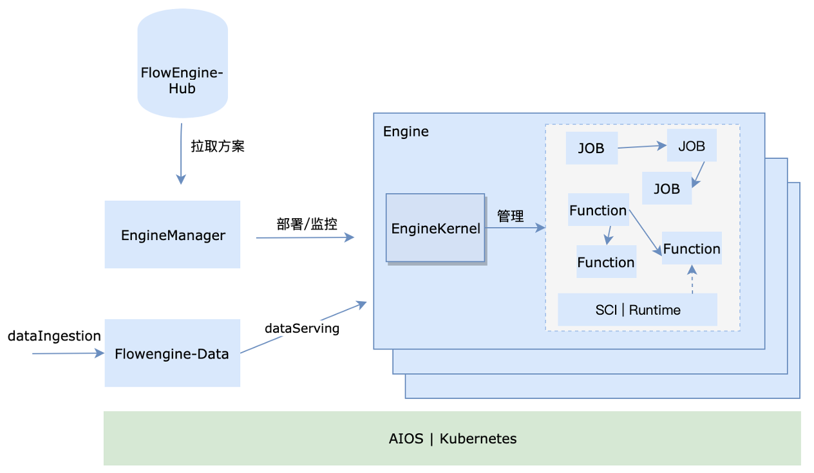
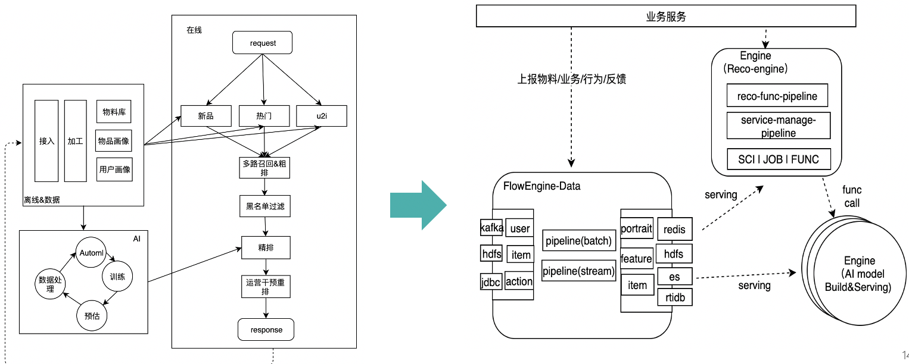

# 基本概念
在学习使用flowengine开发AI应用前，有必要介绍一下Flowengine中的一些关键概念和思想。

## Flowengine的方法论

AI应用场景通常高度与数据相关，这其中包含两个层面的问题，首先，基于数据的AI场景需要有源源的数据输入不断迭代自身，其次，
数据的采集，处理，服务直接影响到最终的效果。而这一个过程是涉及的环节，工具，流程众多，传统的架构难以应对。因此，flowengine
是面向全流程， 闭环，端到端设计，平台托管整个应用的业务全过程，上层开发者只需要通过Flowengine声明式API来定义和管理服务。
下面具体说明框架中的关键概念。

### 基本架构

* FlowEngine-Hub：用于存放方案，组件，FUNC/JOB等资源要素的仓库。
* FlowEngine-App
  - EngineManager：用来管理和监控引擎并作为适配层屏蔽下层复杂度。
  - Engine：引擎实例，是一个内聚业务服务的运行逻辑单元
  - EngineKernel：单个引擎的核心，用于管理当前引擎领域实体，业务流程，并提供运行环境及通信支持。
* Flowengine-Data: 一个AI/BI为一体的数据服务，用于管理引擎数据、元数据及对外提供统一的数据流服务。

从上图可知，flowengine由FlowengineHub,FlowengineData,Engine三个部分构成。其中，Engine是由EngineManager启动并监控。
引擎本身是一个内聚系统，引擎内部的服务以组件的形式存在，并整体由EngineKernel管理。

# FlowEngine 领域概念

| 概念                 | 描述                                                |
|---------------------|----------------------------------------------------------|
| ASOL    | AI solution，即AI方案|
| Engine   | 引擎，由方案实例化而来 |
| EngineKernel | 引擎核心，可管理方案内组件服务，并提供通信，配置等功能  |
| SC    | Service Component，服务组件定义 |
| SCI  | SCI Service Component Instance，引擎中的服务组件实例，编排job/func等执行的runtime |
| Pipeline  | 离线编排，支持编排job |
| JOB Template  | Job 模版，可以复用的单元，类比为class，同一Job模版因为参数不同，可以产生多个job  |
| JOB  | 离线作业，它是基于Job模版设置具体的输入参数产生的  |
| JOB Instance  | Job 实例，pipline运行时，每一个job都会产生一个job运行实例  |
| FUNCTIONPipeline | 在线编排，支持编排function，用在在线实时业务场景  |
| FUNCTION Template  |  Function 模版，类比同JOB模版  |
| FUNCTION  | 在线函数，简写为Func，具体的业务在线函数运行片段，类比JOB |
| FUNCTION Instance | Function 在pipeline运行时产生的实例，类比同JOB实例  |
| StreamPipeline | 流式编排，支持编排function，用在在线实时业务场景  |
| StreamJob Template  |  streamJob 模版，类比同JOB模版  |
| StreamJob  | 流式任务，具体的业务在线函数运行片段，类比JOB |
| StreamJob Instance | StreamJob在pipeline运行时产生的实例，类比同JOB实例  |
| Message | 消息，用于组件，job等资源通信  |
| Config |  配置，用于组件，job等资源读写配置  |
| Context |  上下文，用于组件，job等资源读写上下文信息 |
| PipelineRuntime |  flowengine在线编排服务的运行时，用于加载运行pipeline |
| Worker | flowengine离线编排服务运行时，默认离线编排运行在EngineKernel中。|
| 数据湖 | 即datalake，在flowengineData中定义的数据表|
| 数据流 | 即dataflow，一个数据处理过程，如用户画像的生成流程，它包含多个数据mapping操作|
| 数据transform | 数据表处理的操作，通常支持流式或批量多种处理方式|
| 一级表 | 也叫原始表或铜表，它具有数据摄取的能力|
| 二级表 | 也叫加工表或银表，由一级表经过mapping操作生成|
| 三级表 | 也叫服务表或金表，由二级表经过mapping操作生成，他能对外提供各种serving服务，并可绑定到Engine中供引擎服务消费|

## 业务分解及技术映射

通过flowengine开发AI场景应用，关键是对场景的分析及映射。在flowengine里我们将一个AI应用映射成如下形态。
以一个推荐场景为例：

{:width="50%" }

如图，一个AI的过程就是一个引擎，引擎内部声明了这个过程的运行逻辑，对外暴露数据和服务接口。
而flowengineData对接外部业务系统，并将数据加工完成，绑定到各个场景引擎上，不同引擎对外提供不同的服务，如模型推理服务或是推荐服务。
最终，它们一起形成了一个完整的场景服务。开发一个场景即是定义数据流和引擎服务的过程，通过声明式的API或者界面操作完成整个开发过程。

