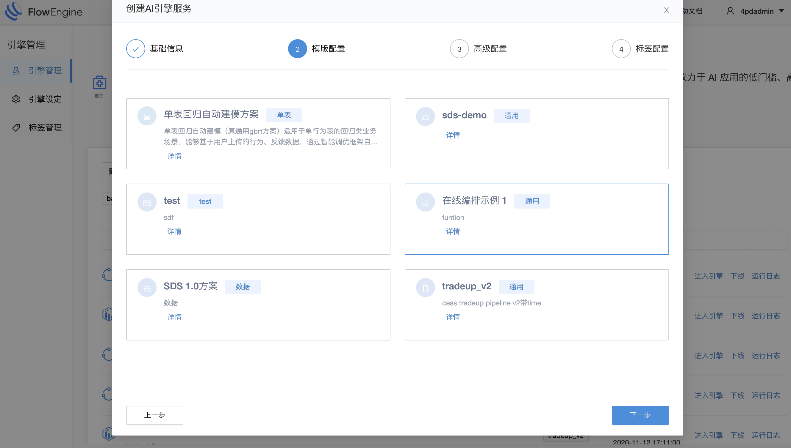
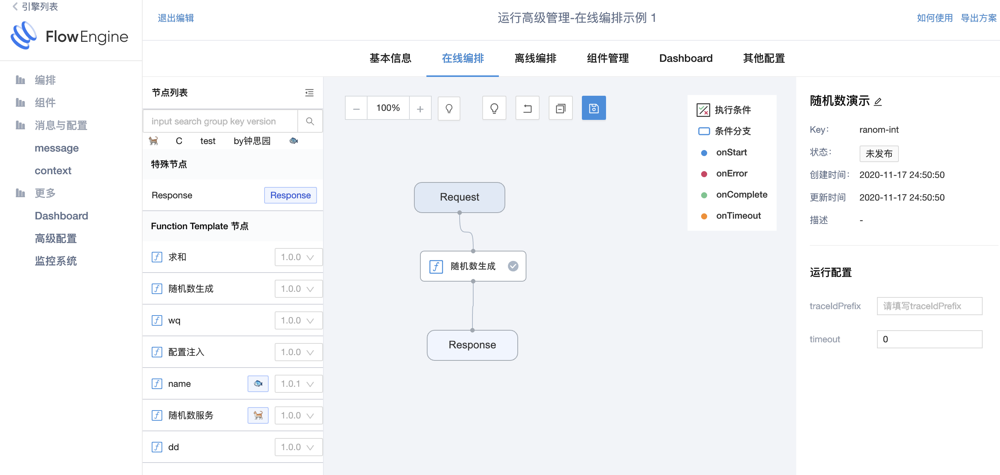
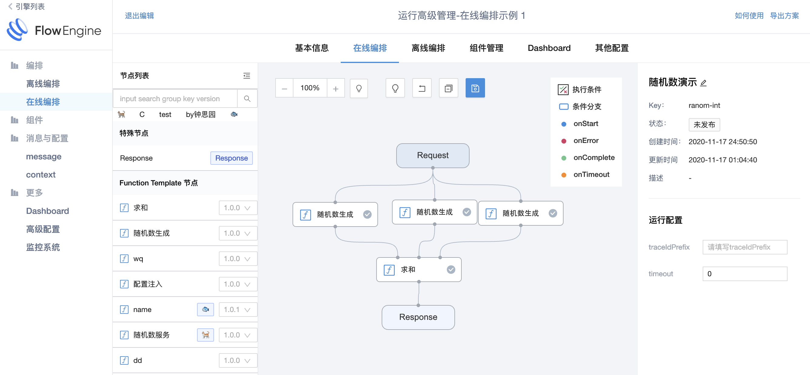
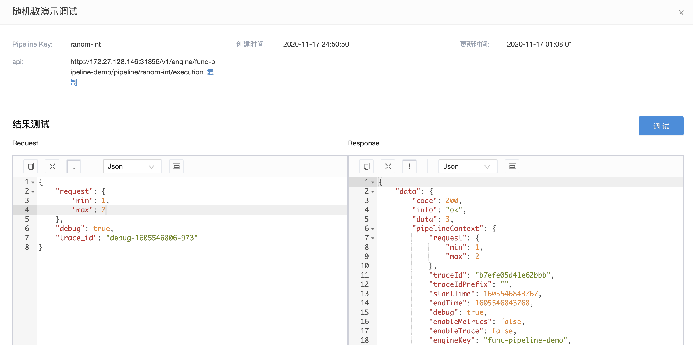
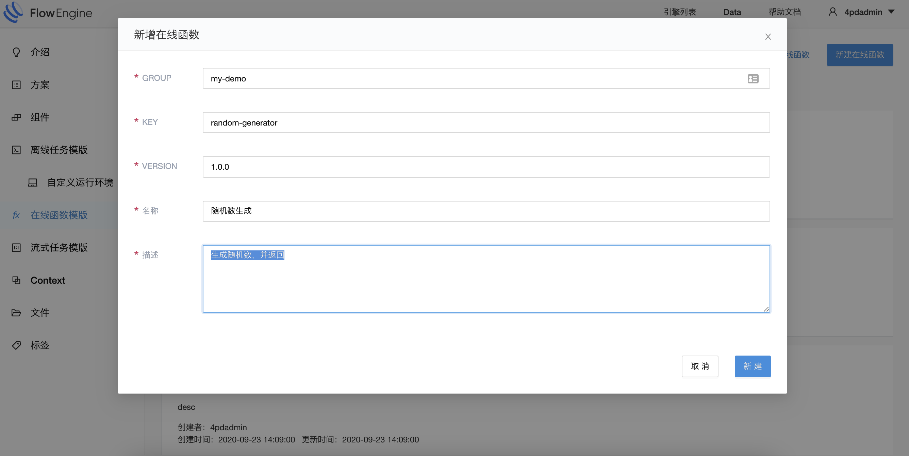
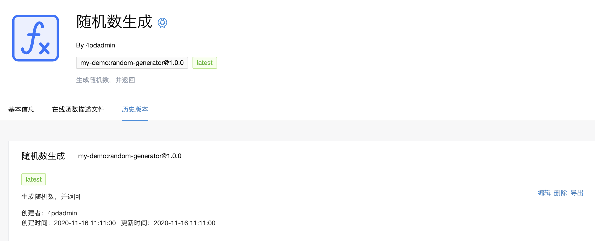
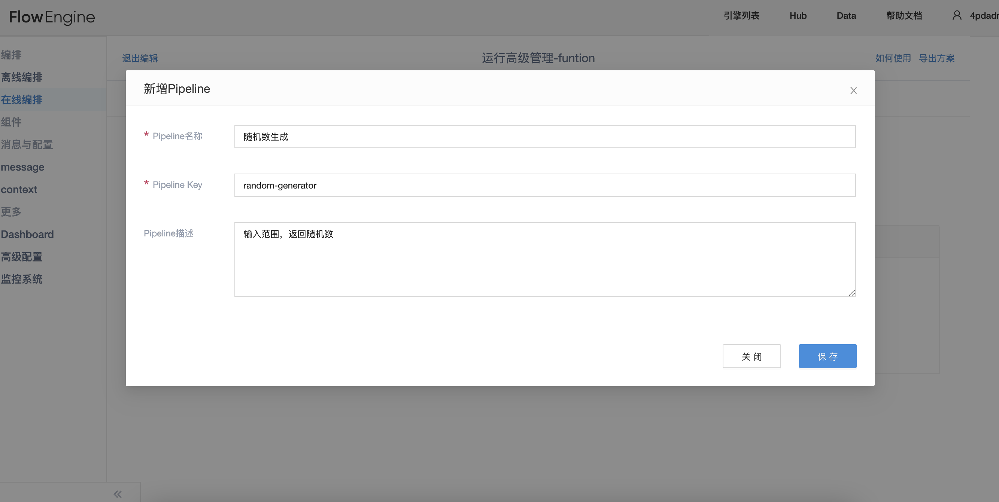
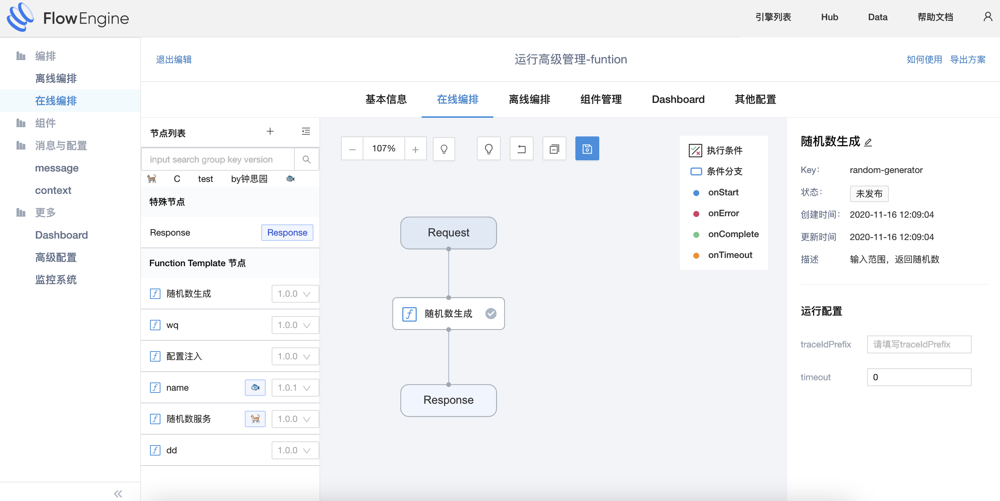
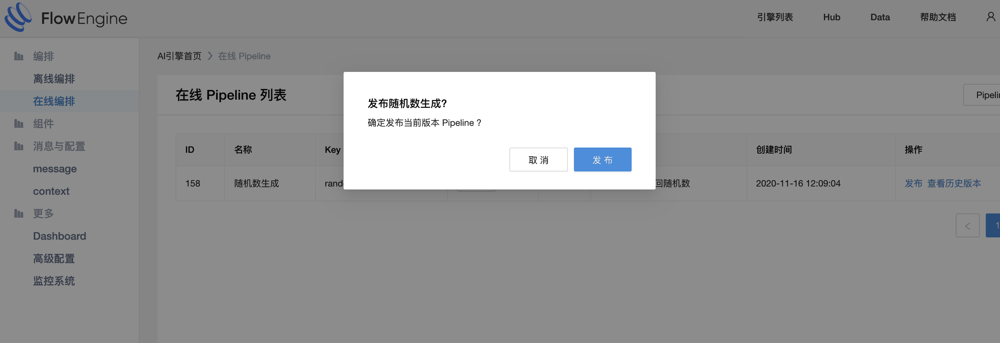

## 开发或者修改一个在线 pipeline

### 演示 - 随机数生成

我们基于内置的在线编排示例方案，创建一个示例引擎。

{:width="50%" }

示例中包含一个默认的在线编排：

{:width="50%" }

其中只包含了一个生成随机数的函数，整个 pipeline 接收请求后，函数将会根据请求的范围限制，生成一个对应范围内的随机数，最终返回结果。

接口调用示例（右边 data->data->result 字段）：

{:width="50%" }

关于此 Function 的详细开发过程可以参考下文。

### 演示 - 多个随机数并求和

如果所示，我们额外添加 2 个“随机数生成”函数节点，再添加 1 个“求和”函数节点（选中函数后点击右侧“添加节点”可增加函数输入槽位），并将其连接起来。

{:width="50%" }

保存、发布后，进行调试：

{:width="50%" }

我们限制随机数范围 [1,2)，此时随机数必然为 1，可以发现最终求和结果为 3，复合预期。

关于此 Function 的详细开发过程可以参考下文。

### Function 代码开发

创建 Java 项目，并添加依赖：

```xml
<dependency>
    <groupId>com._4paradigm.flowengine</groupId>
    <artifactId>fl-pipeline-core</artifactId>
    <version>1.6.2-SNAPSHOT</version>
    <scope>provided</scope>
</dependency>
```

基于基类，开发逻辑代码：

```
// 随机数生成
package com._4paradigm.flowengine.pipeline.demo;

import com._4paradigm.flowengine.pipeline.core.FLFunction;
import com._4paradigm.flowengine.pipeline.core.PipelineContext;

import java.util.HashMap;
import java.util.Map;
import java.util.concurrent.ThreadLocalRandom;

public class RandomGenerator extends FLFunction {
    public Object run(PipelineContext pipelineContext, Object... objects) {
        int min = 0;
        int max = 100;
        if (objects.length != 0) {
            Map<String, Integer> limits = (Map<String, Integer>) objects[0];
            min = limits.getOrDefault("min", 0);
            max = limits.getOrDefault("max", 100);
        }
        Map<String, Integer> result = new HashMap<>();
        result.put("result", ThreadLocalRandom.current().nextInt(min, max));
        return result;
    }
}
```

```
// 基于随机数生成的结果，求和
package com._4paradigm.flowengine.pipeline.demo;

import com._4paradigm.flowengine.pipeline.core.FLFunction;
import com._4paradigm.flowengine.pipeline.core.PipelineContext;

import java.util.Map;

public class SumInt extends FLFunction {
    public Object run(PipelineContext pipelineContext, Object... objects) {
        if (objects == null || objects.length == 0) {
            return 0;
        }
        int result = 0;
        for (Object object : objects) {
            result += (Integer) ((Map) object).get("result");
        }
        return result;
    }
}

```

编译生成 jar 文件：

```
$ mvn clean package
...
[INFO] BUILD SUCCESS
[INFO] ------------------------------------------------------------------------
[INFO] Total time:  1.377 s
[INFO] Finished at: 2020-11-16T11:52:17+08:00
[INFO] ------------------------------------------------------------------------

$ ls */target 
random-generator/target:
classes                             maven-archiver                      random-generator-1.0.0-SNAPSHOT.jar
generated-sources                   maven-status

sum-int/target:
classes                    maven-archiver             maven-status               sum-int-1.0.0-SNAPSHOT.jar
```

### 创建 function template

在 flowengine hub 中创建“在线函数模板”：

{:width="50%" }

创建完成后，点击进入，选择“历史版本”再进行“编辑”，填写必要的信息。

{:width="50%" }

文件类型：目前只可选择 jar，更多模式陆续开放中；

运行文件：function 执行的 jar 文件，可从已上传文件中选择，或手动上传新文件；

Function 类名：Function 完整的类名；

### 创建 pipeline

通过引擎的“高级配置”，
点击『新增Pipeline』来创建 pipeline，必填全局唯一的『Pipeline Key』：

{:width="50%" }

创建完成后，点击『编辑』进入编辑页面，修改 pipeline 拓扑结构与相关配置。

{:width="50%" }

## 发布 pipeline

发布操作只能在引擎中进行，请确保引擎添加并启动了相关组件。

进入左侧“编排”中的“在线编排”，选择对应的 pipeline，即可进行发布操作。

{:width="50%" }

发布完成后，可以点击『调试』进行调用测试，如图输入请求参数，返回中的 data 字段可以看到结果：

{:width="50%" }

通过『查看历史版本』可以查看 pipeline 的历史版本，并进行下线或发布操作：

{:width="50%" }